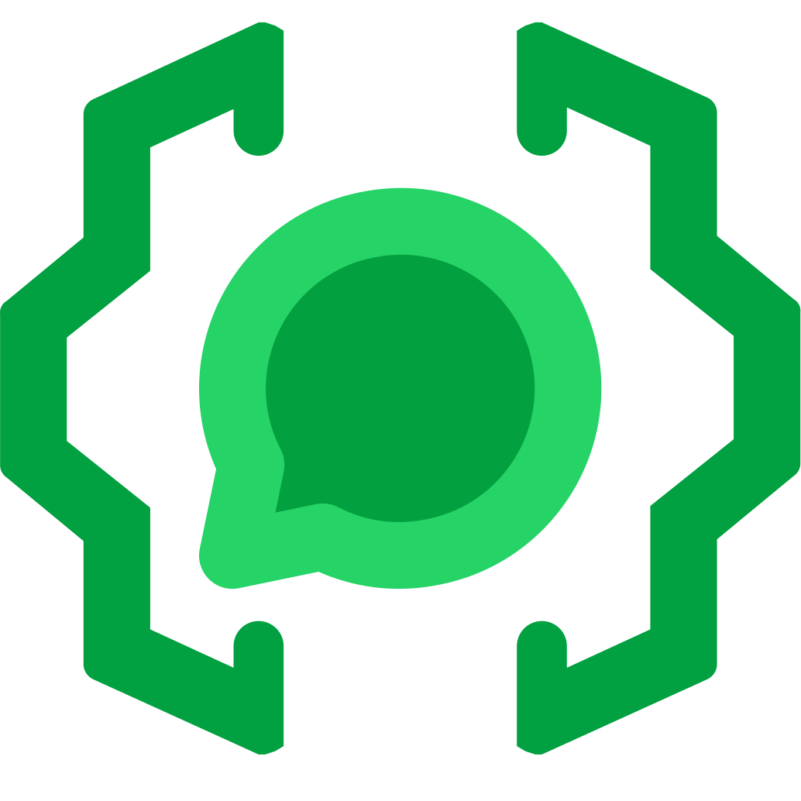
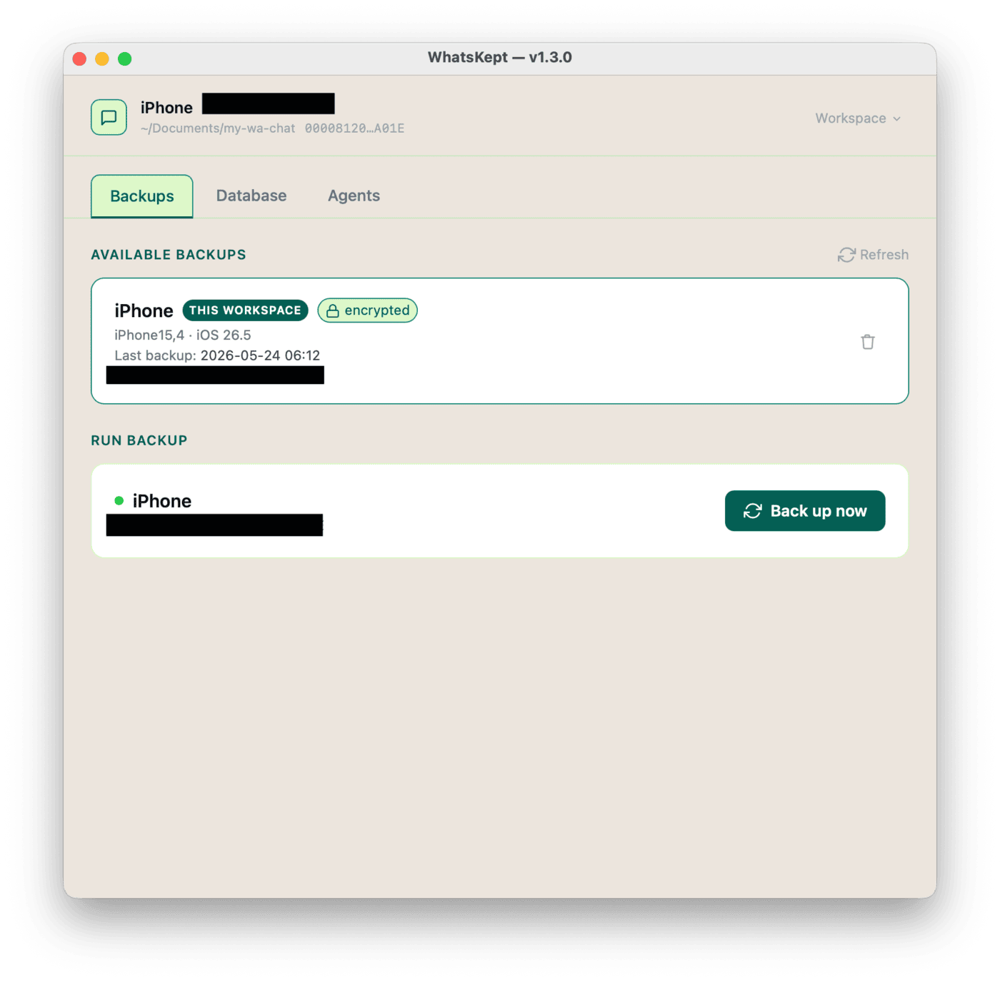
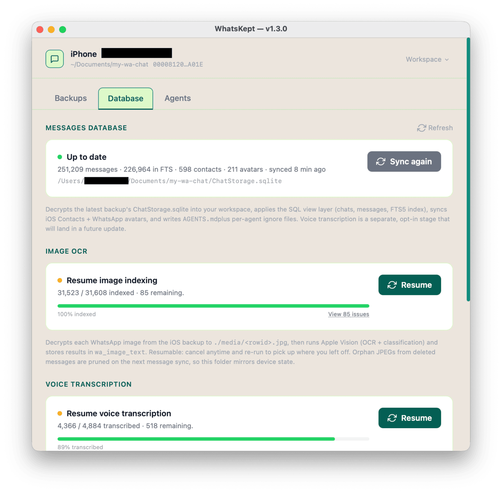
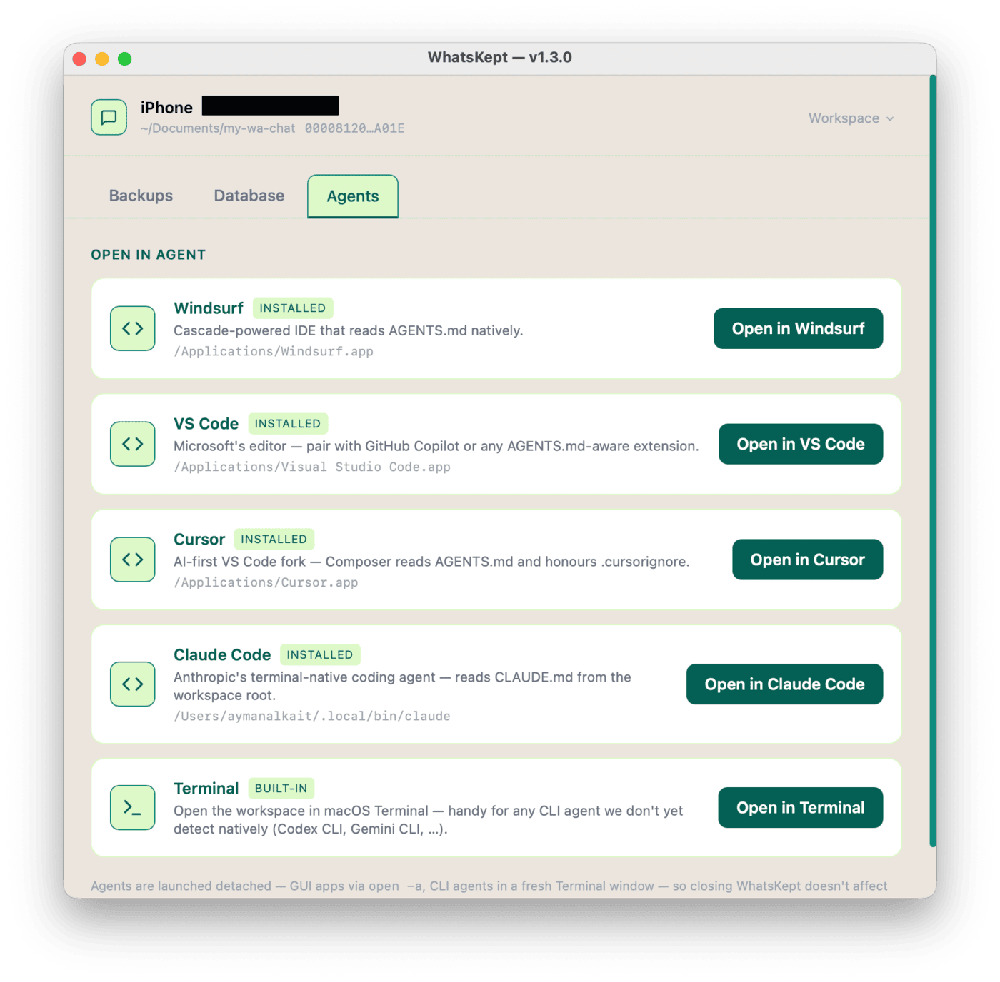
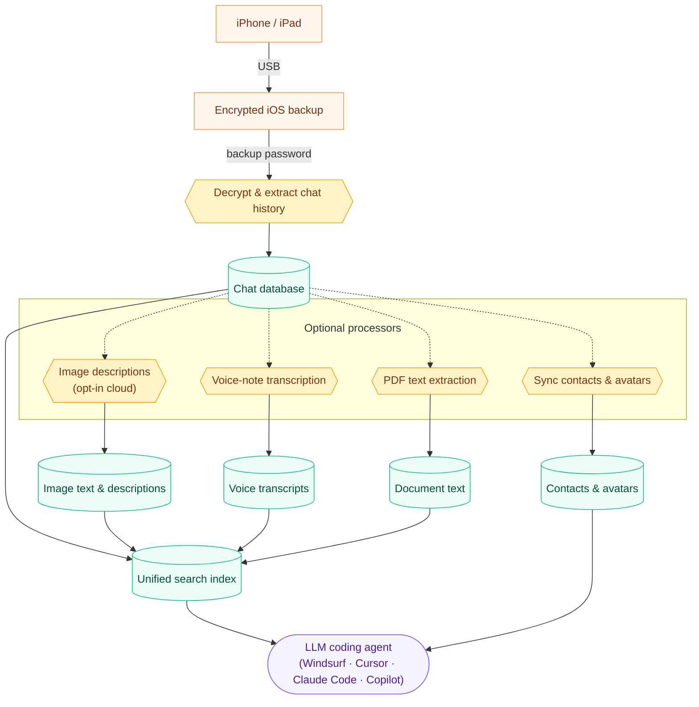

<p align="center">
  
</p>

<h1 align="center">WhatsKept</h1>

Agent-queryable WhatsApp history from an iOS backup, in Go.

A single self-contained binary. Drives iOS backups, decrypts WhatsApp's
ChatStorage.sqlite, and (eventually) feeds it into a searchable
SQLite + FTS5 workspace that an agent can query directly.

## Contents

- [What you can ask](#what-you-can-ask)
- [What this is (and what it isn't)](#what-this-is-and-what-it-isnt)
- [Screenshots](#screenshots)
- [Pipeline](#pipeline)
- [Download](#download)
- [How this was built](#how-this-was-built)
- [System requirements](#system-requirements)
- [Privacy](#privacy)
- [Build](#build)
- [Run](#run)

## What you can ask

Once the workspace is built, point an LLM coding agent at the folder
(Windsurf, Claude Code, Cursor, VS Code + Copilot,etc …) and ask. A few
examples of what becomes possible:

| Use case | Example prompt |
| --- | --- |
| **Find a photo or voice note you only vaguely remember** | *"Find the photo Sara sent of a handwritten recipe — I think it had cardamom in it."* |
| **Recover decisions from a busy group chat** | *"Pull every message in the House Reno group about the kitchen budget and tell me what we landed on."* |
| **Recall a specific fact someone sent you** | *"What dosage did Dr. Patel say for the antibiotic, and how many days?"* |
| **Track receipts, orders, and tracking numbers** | *"List every tracking number anyone sent me in the last 6 months and flag the ones I never confirmed."* |
| **Summarize a relationship or thread** | *"Summarize what my brother and I have talked about this year — what's been on his mind?"* |
| **Reconstruct a timeline** | *"Build a timeline of my 2023 — major events, trips, life changes — using only what's in WhatsApp."* |
| **Index recommendations friends have sent** | *"List every restaurant, book, and movie friends have recommended in the last 2 years, grouped by category."* |
| **Find photos of a specific person** (after tagging them in the People view) | *"Show me a random photo of my son Hasan"* · *"Photos with Hasan and Sara together from 2023."* |

## What this is (and what it isn't)

WhatsKept is a **data pipeline**, not an AI assistant. Its entire job
is to take an encrypted iOS backup and turn it into a clean, local,
agent-friendly workspace on disk.

**What it does**

- **Drives iOS backups** over USB via `idevicebackup2` so you can
  refresh the source without leaving the app.
- **Decrypts** the WhatsApp `ChatStorage.sqlite` and the media/voice
  blobs from the encrypted iOS backup, using your backup password.
- **Processes media locally**: voice-note transcription through
  `whisper.cpp` with Metal, and PDF document text extraction through
  Apple PDFKit (with Vision OCR fallback for scanned pages).
- **Cloud image descriptions** (opt-in): images are read and described
  by a cloud vision model through [OpenRouter](https://openrouter.ai),
  using your own API key — producing OCR text plus a short description.
  This is the **one feature that sends your data off the device** —
  each described image is uploaded to OpenRouter. It is off by default
  and lives behind its own button. See [Privacy](#privacy).
- **Normalizes** everything into a single SQLite database (with FTS5)
  alongside extracted `media/`, `voice/`, `documents/`, and
  `profiles/` folders, joined against your macOS Contacts so chats
  are readable.
- **Writes an `AGENTS.md`** and agent-ignore files so an LLM coding
  agent dropped into the workspace knows the schema and skips the
  heavy binary trees.

**What it does *not* do**

- **No built-in chat, no built-in agent runtime.** WhatsKept never
  sends your messages, transcripts, or contacts to a cloud LLM, and it
  does not "summarize your chats" or answer questions on its own —
  that is the agent's job (see below). The one exception is the
  **opt-in cloud image-description** feature: if you turn it on and
  supply an OpenRouter API key, your images (and only your images) are
  uploaded to OpenRouter for OCR + captioning. It is off by default.
- **No cloud sync, no account, no telemetry.** WhatsKept makes only
  these outbound requests, all to well-known hosts:
  - a version check against the **GitHub** Releases API when the app
    window opens (so it can offer an Update button) — carries none of
    your data;
  - only if you opt into voice transcription, a one-time HTTPS
    download of the whisper model from **HuggingFace** — carries none
    of your data;
  - only if you opt into cloud image descriptions, an API-key
    validation check and one chat-completion request per image to
    **OpenRouter** — these **do** carry image content from your backup.

  Nothing else leaves the machine. There is no account, no analytics,
  and no background sync.
- **No querying for you.** Asking questions like *"what did Alice say
  about the trip?"* is the **agent's** job — you open the workspace
  in Windsurf / VS Code + Copilot / Claude Code / Cursor / etc. and
  let *that* tool read the SQLite database. WhatsKept's
  responsibility ends when the workspace is ready.
- **No modification of the source backup.** The encrypted iOS backup
  under `~/Library/Application Support/MobileSync/Backup/` is read
  only; WhatsKept never writes to it.

Think of it as the **plumbing between your iPhone and your AI agent**:
it turns a locked, encrypted iOS backup into a plain folder of
readable text, searchable messages, and transcribed voice notes —
then steps out of the way and lets the agent you already trust do
the thinking.

## Screenshots

Three tabs, in the order you walk through them:

| 1. Backups | 2. Database | 3. Agents |
| :---: | :---: | :---: |
| [](docs/screenshots/backup_tab.png) | [](docs/screenshots/database_tab.png) | [](docs/screenshots/agent_tab.png) |
| Drive a fresh iOS backup over USB — no need to leave the app. | Decrypt `ChatStorage.sqlite`, describe images, transcribe voice notes, extract PDFs. Each stage is opt-in and resumable. | Open the prepared workspace in Windsurf, VS Code, Cursor, Claude Code, or Terminal. |

## Pipeline

End-to-end data flow, from the encrypted backup on disk to a
workspace your agent can `MATCH` against. The four side-car
indexers (avatars/contacts, images, voice, documents) are all
**opt-in** — each one lives behind its own button in the Database
tab and can be skipped, re-run, or resumed independently. Decryption,
contacts/avatars, voice transcription, and PDF extraction all run
**on-device**. The one exception is the **opt-in cloud image
descriptions** path — if you enable it, images are uploaded to
OpenRouter to be read and described.



Each on-device processor is **opt-in** — skip it, run it later, or
re-run to resume where it left off. Re-running the top-level sync
carries the already-processed work forward and prunes anything tied
to messages you've since deleted on the phone.

### People (face tagging)

The **People** step (Database tab → Image enrichment) groups the faces in
your photos so you can find everyone who recurs. It runs **entirely on your
Mac**: Apple Vision detects + aligns faces, an on-device face-recognition
model embeds them, and they're clustered into people. Nothing is uploaded.

The model (AdaFace, MIT — see
[`build/faces-helper/convert/`](build/faces-helper/convert/)) is **not**
bundled; it's downloaded once on first use (~120 MB) to
`~/Library/Application Support/whatskept/models/` and SHA-256 verified, the
same way the Whisper speech model is.

You then **name** the people you care about in the grid (type a name; the
same name on two groups merges them; ✕ a stray photo to remove it). Naming
happens in the app; the tags are written into `ChatStorage.sqlite`
(`wa_person` / `wa_person_face` / the `v_person_photo` view) and carried
forward across re-syncs. Your agent reads them — *"show me photos of
hasan"* resolves to the messages and `open`s the images. The app itself is
only for tagging; querying is the agent's job.

## Download

Pre-built **macOS arm64 (Apple Silicon)** binaries, ad-hoc signed.

**Recommended — one Terminal command, zero Gatekeeper friction:**

```bash
/bin/bash -c "$(curl -fsSL https://github.com/alkait/WhatsKept/releases/latest/download/install.sh)"
```

The script downloads the latest `WhatsKept.app`, verifies its
SHA-256 against the release's `SHA256SUMS`, drops it into
`/Applications`, and launches it. Re-run after every update.

**Other ways to get it:**

- **GUI app via browser** — [`WhatsKept-darwin-arm64.app.zip`](https://github.com/alkait/WhatsKept/releases/latest/download/WhatsKept-darwin-arm64.app.zip).
  Unzip, then double-click `Install WhatsKept.command` inside the
  unzipped folder. Right-click → **Open** the first time macOS
  asks to confirm it.
- **CLI binary** — [`whatskept-darwin-arm64.zip`](https://github.com/alkait/WhatsKept/releases/latest/download/whatskept-darwin-arm64.zip).
  Bare Mach-O for `whatskept extract` / `whatskept list` and
  scripted use.
- **All releases & changelogs** — [github.com/alkait/WhatsKept/releases](https://github.com/alkait/WhatsKept/releases).

> Prefer to build from source? See [Build](#build) below.

## How this was built

> Built in a weekend with **Claude Opus 4.7**, burning ~**$600** in
> tokens so you don't have to. Practically every line of code in this
> repo is AI-generated. I won't pretend I read it line by line — I
> didn't — but I stood behind **every architecture decision**: how
> the backup is decrypted, where secrets live, what crosses a
> network boundary, how the workspace is laid out, why the binary
> ships self-contained. The agent wrote the code; the design, the
> trade-offs, and the privacy posture are mine.

## System requirements

- **macOS 13.0 Ventura or later** on **Apple Silicon (arm64)** — the
  bundled Swift Vision helper is arm64-only, the embedded
  libimobiledevice dylibs come from `/opt/homebrew/*`, and the bundled
  `whisper-cli` is compiled with `GGML_METAL=ON`.
- **Full Disk Access** for WhatsKept.app (or your Terminal, if you
  launched from a shell) — required to read
  `~/Library/Application Support/MobileSync/Backup/`. Grant under
  System Settings → Privacy & Security → Full Disk Access.
- **An iOS backup of an iPhone/iPad with WhatsApp installed**, plus
  its **encryption password**. The extractor reads `$BACKUP_PASSWORD`
  or a `.env` file in the workspace; it never prompts.
- **USB connection to the device** if you want to drive a fresh
  backup from the Backups tab

## Privacy

WhatsKept is designed to keep your WhatsApp history on your machine.

**The good**

- **No telemetry, no analytics, no accounts.** By default WhatsKept
  sends none of your data anywhere. Its always-on outbound call is a
  version check to GitHub when the window opens; the whisper-model
  download and the cloud image-description feature are both opt-in
  (all three below). The version check and model download contact a
  well-known host and carry none of your WhatsApp data. The GUI's HTTP
  server binds to `127.0.0.1` only — it is not reachable from other
  devices on your network.
- **Local processing stays on-device.** Voice transcription runs
  through `whisper.cpp` with Metal acceleration; PDF text extraction
  runs through Apple PDFKit + Vision OCR (`whatskept-vision`); **face
  detection + recognition** for the People feature run through Apple
  Vision + a local CoreML model (`whatskept-faces`). None of them talk
  to a cloud service — that data never leaves the Mac. (Image
  *descriptions* are the exception: they're cloud-only and opt-in — see
  below.)
- **Backup password is never transmitted.** It's read from
  `$BACKUP_PASSWORD` or a `.env` file in the workspace, held in
  process memory for the lifetime of the app session, and cleared
  when you switch workspaces or quit. Not written anywhere by
  WhatsKept on its own.
- **Whisper model: one opt-in download.** The first time you run voice
  transcription, the ~574 MB whisper model is downloaded from
  HuggingFace over HTTPS and SHA-256 verified. After that, that
  feature is fully offline.
- **Cloud image descriptions use your own key, held in RAM only.** The
  opt-in OpenRouter feature (below) uses an API key *you* supply. It is
  validated against `openrouter.ai`, kept in process memory for the
  session, and never written to disk by WhatsKept; it is cleared when
  you switch workspaces or quit. WhatsKept sends no account or
  identifier of its own — just your key and the image being described.
- **Update check on launch.** When the app window opens it asks the
  GitHub Releases API whether a newer version exists, so it can show
  the **Update** button in the header. It's a single unauthenticated
  `GET` to `api.github.com` — no account, no identifiers, none of your
  data. If GitHub is unreachable the app stays quiet and works normally
  offline. Clicking Update re-runs the official `install.sh` in
  Terminal (the same command in the install instructions above).

**What to be cautious about**

- **Cloud image descriptions send your images off the device.** This is
  the one feature that breaks the on-device guarantee. When you enable
  it, each described image is uploaded to OpenRouter
  (`https://openrouter.ai/api/v1/chat/completions`) along with a fixed
  OCR + caption prompt; OpenRouter (and the upstream model provider it
  routes to) sees those image bytes, and they are subject to
  OpenRouter's data-retention policy, not WhatsKept's. Only images are
  sent — never your text messages, voice notes, or contacts — and only
  for the images you choose to run. The feature is **off by default**;
  if you never enter an API key and never start a cloud run, nothing is
  ever uploaded. Image description is the only describer — there is no
  on-device alternative — so skip it entirely if you want zero image
  data to leave the machine (text search, voice, and PDFs still work).
- **The workspace contains *decrypted* WhatsApp data.** `ChatStorage.sqlite`,
  `media/`, `voice/`, `documents/`, and `profiles/` are plaintext on
  disk, and the Messages sync also joins your macOS Contacts (names + phone
  numbers) into the database so chats are readable. Anyone with
  read access to that folder (other macOS users, Time Machine
  backups, cloud-sync folders like iCloud Drive / Dropbox / Google
  Drive) can read every message, contact, photo, and voice note.
  Pick a workspace path accordingly — `~/Documents` is fine,
  `~/Dropbox` is not.
- **The agent reads the text, but not the raw files.** WhatsKept
  drops `.windsurfignore`, `.copilotignore`, and similar ignore
  files so agents stay out of the `media/`, `voice/`, `documents/`,
  and `profiles/` folders — the actual photos, audio files, PDFs, and
  profile pictures are off-limits. What the agent *does* see is everything
  in the SQLite database: every message, every image's OCR'd text
  and description, every voice-note transcript, and the
  contact names and numbers joined in. So when you ask a question,
  chunks of that chat history can be sent to the agent's LLM
  provider. **Trust the agent's privacy story before pointing it at
  the workspace.**
- **The `.env` file holds your backup password in plaintext.** It
  lives inside the workspace directory; don't commit it to git, and
  don't ship the workspace folder anywhere.
- **Workspace deletion is permanent.** The Delete button wipes the
  whole directory tree — there is no recycle bin, no undo. The
  encrypted iOS backup is untouched, so a fresh sync rebuilds, but
  any notes/state you kept in the workspace are gone.

## Build

```bash
make build            # → dist/whatskept (always re-signs after build)
```

The Makefile invokes `build/sign.sh` after `go build`. This is **not
optional** on Apple Silicon: post-link byte modifications by macOS
tooling can silently invalidate the linker-emitted ad-hoc signature,
producing a binary the kernel refuses to start (the process freezes
with zero CPU time and cannot be killed). Re-signing fixes it
unconditionally.

## Run
```bash
make app
```