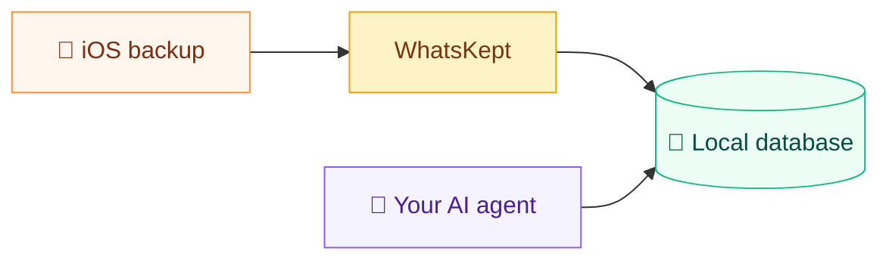

<p align="center">
  
</p>

<h1 align="center">WhatsKept</h1>

Agent-queryable WhatsApp history from an iOS backup, in Go.

A single self-contained binary. Drives iOS backups, decrypts WhatsApp's
ChatStorage.sqlite, and feeds it — messages, images, voice notes, and PDF
documents — into a searchable SQLite + FTS5 workspace that an agent can
query directly.

## Contents

- [What you can ask](#what-you-can-ask)
- [What this is (and what it isn't)](#what-this-is-and-what-it-isnt)
- [Screenshots](#screenshots)
- [Pipeline](#pipeline)
- [Download](#download)
- [How this was built](#how-this-was-built)
- [Privacy](#privacy)

## What you can ask

Once the workspace is built, point an LLM coding agent at the folder
(Windsurf, Claude Code, Cursor, VS Code + Copilot,etc …) and ask. A few
examples of what becomes possible:

| Use case | Example prompt |
| --- | --- |
| **Find a photo or voice note you only vaguely remember** | *"Find the photo Sara sent of a handwritten recipe — I think it had cardamom in it."* |
| **Recover decisions from a busy group chat** | *"Pull every message in the House Reno group about the kitchen budget and tell me what we landed on."* |
| **Recall a specific fact someone sent you** | *"What dosage did Dr. Patel say for the antibiotic, and how many days?"* |
| **Track receipts, orders, and tracking numbers** | *"List every tracking number anyone sent me in the last 6 months and flag the ones I never confirmed."* |
| **Summarize a relationship or thread** | *"Summarize what my brother and I have talked about this year — what's been on his mind?"* |
| **Reconstruct a timeline** | *"Build a timeline of my 2023 — major events, trips, life changes — using only what's in WhatsApp."* |
| **Index recommendations friends have sent** | *"List every restaurant, book, and movie friends have recommended in the last 2 years, grouped by category."* |

## What this is (and what it isn't)

WhatsKept is a **data pipeline**, not an AI assistant. Its entire job
is to take an encrypted iOS backup and turn it into a clean, local,
agent-friendly workspace on disk.

**What it does**

It pulls a fresh backup off your iPhone, decrypts WhatsApp's messages, and turns it into one searchable folder on disk — ready for a coding agent to read. Optionally, with your own OpenRouter's API key, it can describe images, transcribe voice notes, and extract text from PDFs so the agent can query them too.

**What it does *not* do**

It doesn't chat, summarize, or answer questions on its own — that's the
agent's job. Nothing leaves your machine unless you opt in to cloud
enrichment, and your iPhone backup is never modified.

Think of it as the **plumbing between your iPhone and your AI agent**

## Screenshots

Three tabs, in the order you walk through them:

| 1. Backups | 2. Database | 3. Agents |
| :---: | :---: | :---: |
| [](docs/screenshots/backup_tab.png) | [](docs/screenshots/database_tab.png) | [](docs/screenshots/agent_tab.png) |
| Drive a fresh iOS backup over USB — no need to leave the app. | Decrypt `ChatStorage.sqlite`, describe images, transcribe voice notes, extract PDFs. Each stage is opt-in and resumable. | Open the prepared workspace in Windsurf, VS Code, Cursor, Claude Code, or Terminal. |

## Pipeline

The whole idea in one line: WhatsKept turns your encrypted iPhone
backup into a plain, local database — then gets out of the way so your
agent can read it.



Everything stays on your own computer, and the agent you already use
does the asking.

## Download

**macOS** (Apple Silicon) — recommended, one Terminal command:

```bash
/bin/bash -c "$(curl -fsSL https://github.com/alkait/WhatsKept/releases/latest/download/install.sh)"
```

Or [download `WhatsKept-darwin-arm64.app.zip`](https://github.com/alkait/WhatsKept/releases/latest/download/WhatsKept-darwin-arm64.app.zip), unzip, and double-click `Install WhatsKept.command`.

**Windows** (10/11, x64) — [download `WhatsKept-windows-amd64.zip`](https://github.com/alkait/WhatsKept/releases/latest/download/WhatsKept-windows-amd64.zip), unzip, and run `whatskept.exe`.

## How this was built

> Built in a weekend with **Claude Opus 4.7**, burning millions of
> tokens so you don't have to. Practically every line of code in this
> repo is AI-generated. I won't pretend I read it line by line — I
> didn't — but I stood behind **every architecture decision**: how
> the backup is decrypted, where secrets live, what crosses a
> network boundary, how the workspace is laid out, why the binary
> ships self-contained. The agent wrote the code; the design, the
> trade-offs, and the privacy posture are mine.

## Privacy

**The good**

- **No telemetry, no analytics, no accounts.** WhatsKept
  sends none of your data anywhere — the only automatic call is a
  version check to GitHub when the app opens. Cloud enrichment is the
  one exception, and it's opt-in (below).
- **Enrichment is opt-in and cloud-only.** Image *descriptions*, voice
  *transcription*, and PDF *text extraction* run through cloud AI models
  (OpenRouter) — they're the features that send the images / voice notes
  / documents you choose to run off the device.

**What to be cautious about**

- **You're keeping a decrypted copy of your entire WhatsApp on your
  computer.** Even though it stays local, that plaintext database of
  every message, photo, and voice note is a risk — anyone with
  access to your machine can read all of it. You own that risk.
- **Opting in to image, voice, and PDF enrichment sends that content to
  public AI models.** Every image, voice message, and PDF you run
  through enrichment is uploaded to a third-party AI provider to be
  described, transcribed, or read.
- **Everyday querying also sends your messages to public AI providers.**
  When you ask your agent a question, it sends the relevant chunks of
  your WhatsApp history to whatever LLM provider that agent uses.
